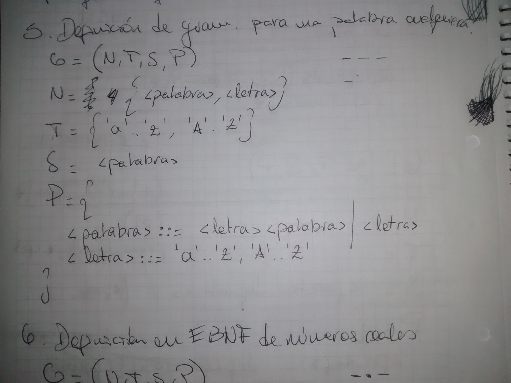
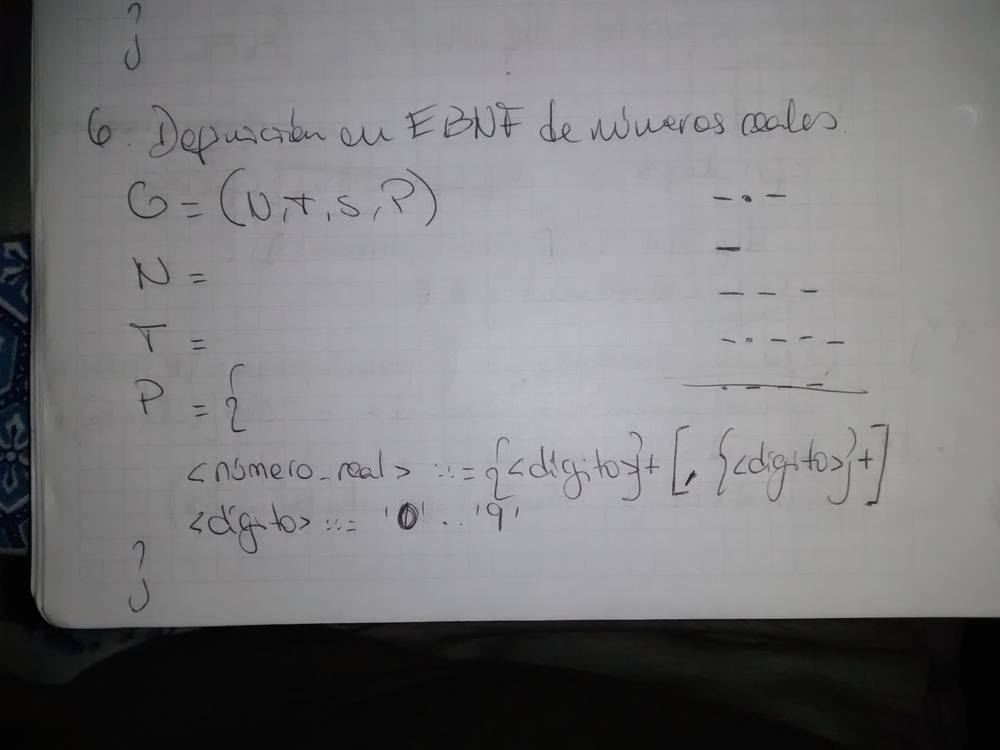
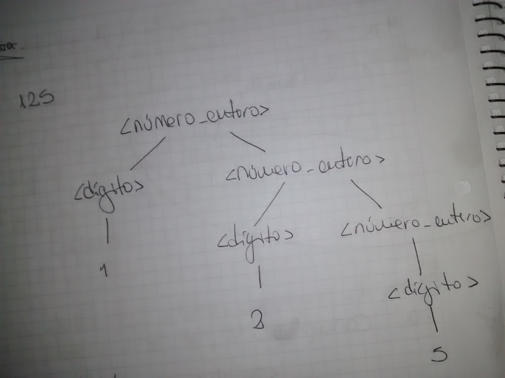
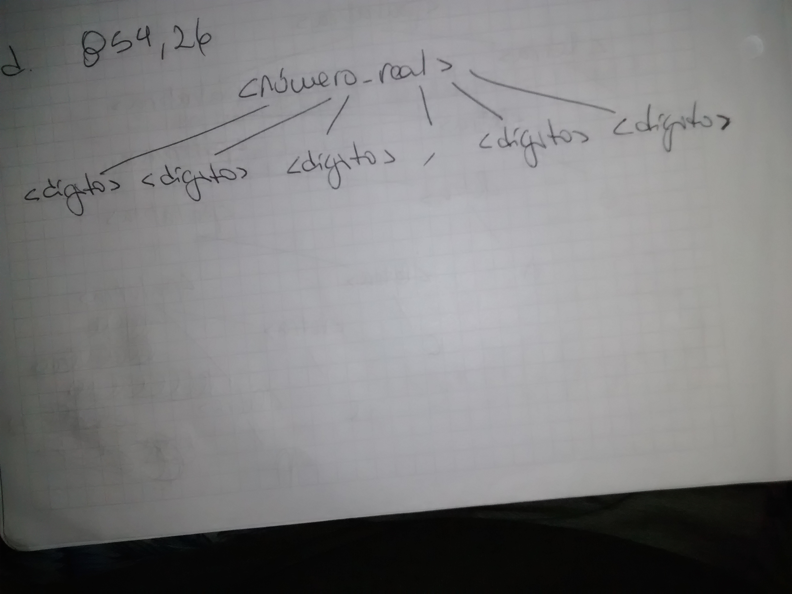
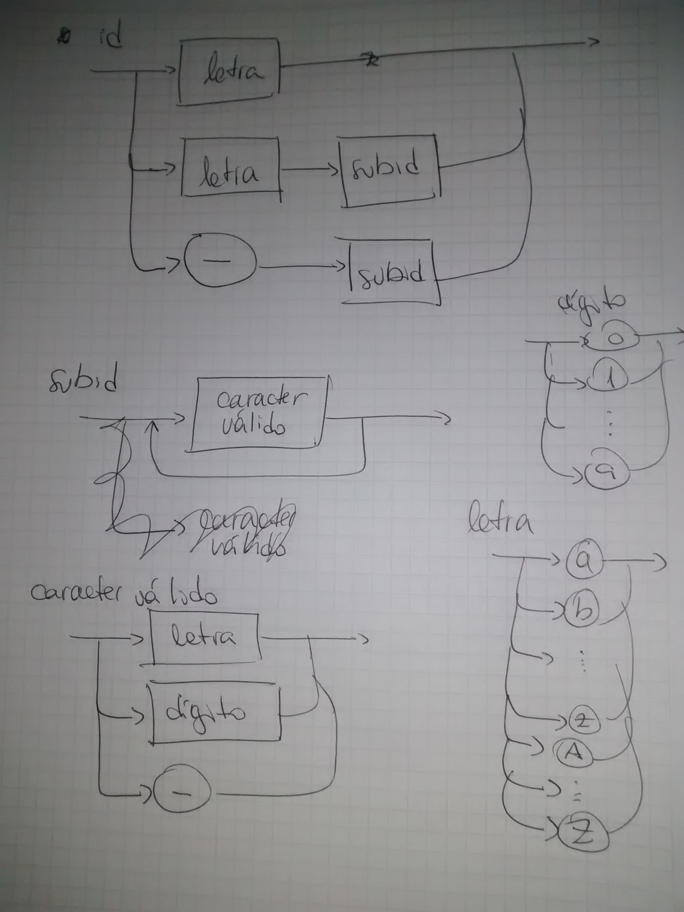

# Práctica 2

## Ejercicio 1

> ¿Cuál es la importancia de la sintaxis para un lenguaje? ¿Cuáles son sus elementos?

La **sintaxis** describe la *forma* del lenguaje. Describe por completo la apariencia del mismo: cuáles serán sus palabras claves, cuáles serán los operadores válidos, cómo podrán ser formados los identificadores, cómo se separarán las sentencias, etc. Se encuentra estrechamente ligada a aspectos importantes de los lenguajes como la legibilidad y la facilidad de escritura, ya que una sintaxis diseñada cuidadosamente genera construcciones simples de entender y de escribir.

Los elementos de la sintaxis son:

* alfabeto
* identificadores
* operadores
* palabras clave y reservadas
* comentarios y blancos

## Ejercicio 2

> Defina *regla lexicográfica* y *regla sintáctica*.

Las **reglas lexicográficas** determinan, a partir del alfabeto, las *words* que se usarán en el lenguaje.

Las **reglas sintácticas** especifican *cómo* combinar las *words* para formar expresiones y sentencias.

## Ejercicio 3

Las *palabras reservadas* son palabras que no pueden ser usadas como identificadores. Este concepto se suele confundir con el de *palabra clave*, que se refiere a palabras que tienen un cierto significado en un cierto contexto. En la definición de una gramática, las palabras reservadas serían `G`, `N`, `T`, `S` y `P`.

## Ejercicio 4

> Dada la siguiente gramática escrita en BNF:
> 
> ```
> G= ( N, T, S, P)
> N = {<numero_entero>, <digito> }
> T = {0, 1, 2, 3, 4, 5, 6, 7, 8, 9}
> S = <numero_entero>
> P={
> <numero_entero>::=<digito><numero_entero> | <numero_entero><digito> | <digito>
> <digito> ::= 0 | 1 | 2 | 3 | 4 | 5 | 6 | 7 | 8 | 9
}
> ```
> 
> a. Identifique los componentes.
> 
> b. Indique por qué es ambigua y corríjala.

**a**.

* `G`: 4-tupla que engloba a los conjuntos que contienen las reglas léxicas y sintácticas a partir de las cuales se define la gramática.
* `N`: conjunto de símbolos no terminales.
* `T`: conjunto de símbolos terminales.
* `S`: símbolo más genérico.
* `P`: conjunto de producciones que determinan las reglas.

**b**. Es ambigua porque dado un número, por ejemplo `10`, se podrían construir dos árboles sintácticos. Para corregir este problema bastaría con eliminar `<digito><numero_entero>` o `<numero_entero><digito>` de la definición del símbolo `<número_entero>`.

## Ejercicio 5



## Ejercicio 6



## Ejercicio 7

**c**.


**d**.


## Ejercicio 8



## Ejercicio 9

**b**. Expresión numérica. Números y *+, -, \* y /*. Prioridad entre operadores. Posibilidades: